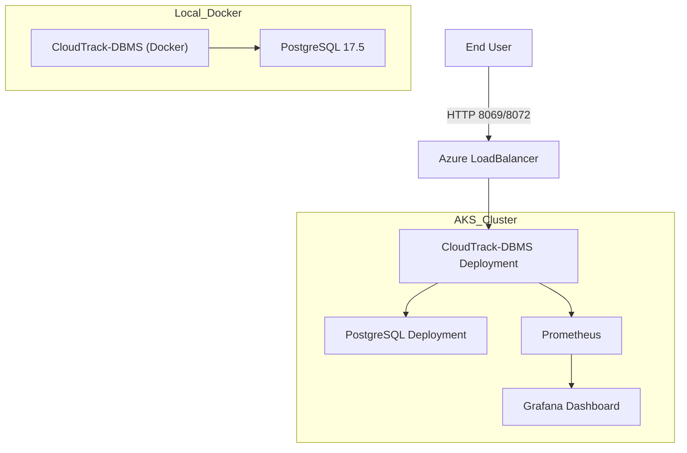

# 🌐 CloudTrack IT-2025 — CloudTrack-DBMS + PostgreSQL Deployment

## 📌 Project Scope
This repository contains the **CloudTrack Database Management System (DBMS)** project, designed and deployed for **FUTMinna IT-2025 CloudTrack initiative**.  
It integrates **CloudTrack-DBMS-Odoo 18 ERP** with a **PostgreSQL backend**, supporting both **local Docker-based builds** and **cloud-native deployment on Azure Kubernetes Service (AKS)**.

The project demonstrates:
- Building custom Odoo 18 images with FUTMinna-specific modules.
- Automated PostgreSQL initialization and database restore.
- Local development via Docker Compose.
- Production deployment on **Azure AKS** with scaling, monitoring, and stress testing.
- End-to-end documentation for setup, debugging, and performance validation.

---

## 📂 Repository Structure

```
cloudbase/
├── addons/                # Custom Odoo modules (FUTMinna + OpenEduCat)
├── deployment/            # AKS manifests, stress testing, monitoring setup
├── docker-build/          # Dockerfile + Compose for local image build
├── docker-pull-image/     # Prebuilt image pull + Compose for quick start
├── cloudtrack.xml         # Cluster state, pod/service metrics
├── it2025_clean.dump      # Preloaded PostgreSQL database dump
└── LICENSE
```

---

## ⚙️ Architecture Overview

- **Local Development (Docker)**  
  - PostgreSQL 17.5 container with preloaded `it2025` database.  
  - CloudTrack-DBMS container with FUTMinna + OpenEduCat modules baked in.  
  - Configurable via `docker-compose.yaml`.  

- **Cloud Deployment (AKS)**  
  - Kubernetes manifests for CloudTrack-DBMS + PostgreSQL.  
  - InitDB scripts via ConfigMaps.  
  - Exposed externally via Azure LoadBalancer (`odoo-svc`).  
  - Monitoring stack: Prometheus + Grafana.  
  - Stress testing with k6/Locust for **10,000+ concurrent logins**.  

---

## 🚀 Build & Deployment

### 🔧 Local Build (docker-build/)
1. Clone repo:
   ```bash
   git clone https://github.com/Legacy-G/Cloud-Track-IT-2025-Database-Management-System.git
   cd Cloud-Track-IT-2025-Database-Management-System/docker-build
   ```
2. Place custom modules in `addons/`.
3. Configure `config/odoo.conf`.
4. Build and run:
   ```bash
   docker-compose build --no-cache
   docker-compose up -d
   ```
5. Access CloudTrack-DBMS: [http://localhost:8069](http://localhost:8069)  
   Database: `it2025` | User: `admin` | Password: `admin`

---

### ⚡ Quick Start (docker-pull-image/)
1. Navigate to `docker-pull-image/`.
2. Start stack with prebuilt image:
   ```bash
   docker-compose up -d
   ```
3. CloudTrack-DBMS UI available at [http://localhost:8069](http://localhost:8069).

---

### ☁️ Cloud Deployment (deployment/)
1. Connect to AKS:
   ```bash
   az aks get-credentials --resource-group cloudtrackit2025 --name cloudtrack
   ```
2. Apply manifests:
   ```bash
   kubectl apply -f manifest.yaml
   ```
3. Verify:
   ```bash
   kubectl -n odoo-prod get all
   ```
4. Access via LoadBalancer:
   ```
   http://<EXTERNAL-IP>:8069
   http://<EXTERNAL-IP>:8069/web/database/manager
   ```

---

## 📊 Scaling & Cost Analysis

| Scenario | Node Size | Node Count | vCPU Total | Memory Total | Est. Monthly Cost (USD) | Notes |
|----------|-----------|------------|------------|--------------|--------------------------|-------|
| Baseline | Standard_B2s (2 vCPU, 7 GB) | 2 | 4 vCPU | 14 GB | ~$90 | Handles ~2k concurrent logins |
| Medium   | Standard_B4ms (4 vCPU, 16 GB) | 3 | 12 vCPU | 48 GB | ~$400 | Handles ~5k concurrent logins |
| Large    | Standard_B8ms (8 vCPU, 32 GB) | 4 | 32 vCPU | 128 GB | ~$1200 | Handles ~10k+ concurrent logins |
| Optimized| Standard_D8s_v5 (8 vCPU, 32 GB) | 3 | 24 vCPU | 96 GB | ~$900 | Balanced CPU/memory, better IOPS |

> 💡 Costs are approximate Azure PAYG estimates (excluding storage, bandwidth, monitoring).  
> Scaling tuned based on **stress test results** and **real-world traffic patterns**.

---

## 📈 Monitoring & Stress Testing

- **Prometheus + Grafana**: latency, throughput, error rates, pod metrics.  
- **Azure Monitor**: node-level CPU/memory/network, pod restarts.  
- **k6/Locust**: simulate 10k+ concurrent logins, analyze bottlenecks.  
- Results documented in `stresstest-result-analysis.md`.

---

## ✅ Key Outcomes
- Built and tested **custom Odoo 18 image** with FUTMinna modules.  
- Automated PostgreSQL restore with preloaded `it2025` database.  
- Local development stack via Docker Compose.  
- Production-ready deployment on **Azure AKS**.  
- Stress-tested at scale with monitoring insights.  

---

## 📌 Next Steps
- Add **pgbouncer** for Postgres connection pooling.  
- Configure **HPA** for Odoo workers.  
- Integrate **CI/CD pipeline** for automated deployments.  
- Harden security (TLS, secrets management, RBAC).  

---

## 📊 Architecture Diagram (Mermaid)



---

## 🧑‍💻 Author
Built, deployed, and tested by **Gbure Thomas**  
for **IT-2025 CloudTrack Project (FUTMinna)**.
